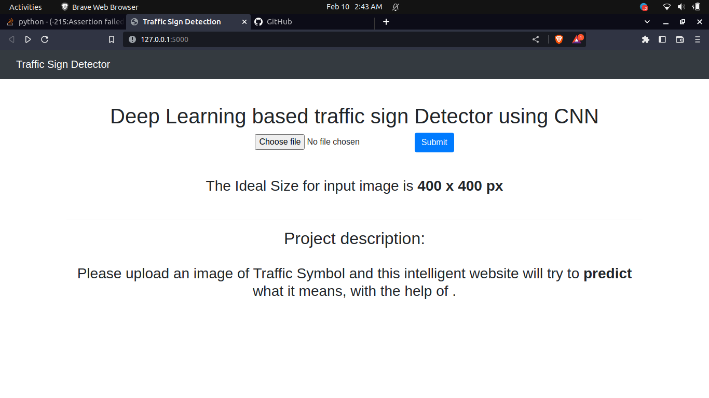
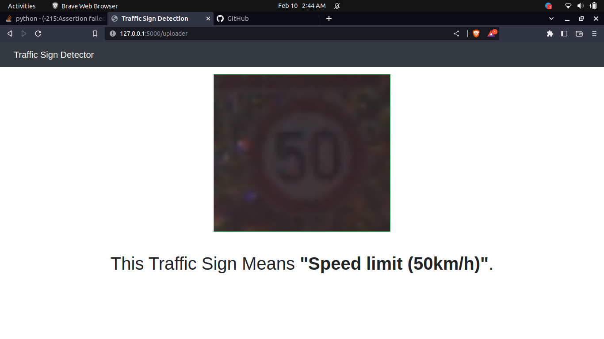

# Traffic-Sign-Detector-using-CNN


Deep learning (CNN) based project to detect traffic signs. 

The dataset used to train the model : GTSRB - [German Traffic Sign Recognition Benchmark]


## Run Locally

Clone the project

```bash
  git clone https://github.com/arindam-bhowal/Traffic-SIgn-Detector-using-CNN.git
```

Go to the project directory


Install dependencies

```bash
  pip install -r requirement.txt
```

Start the server

```bash
  python app.py
```


## Screenshots





